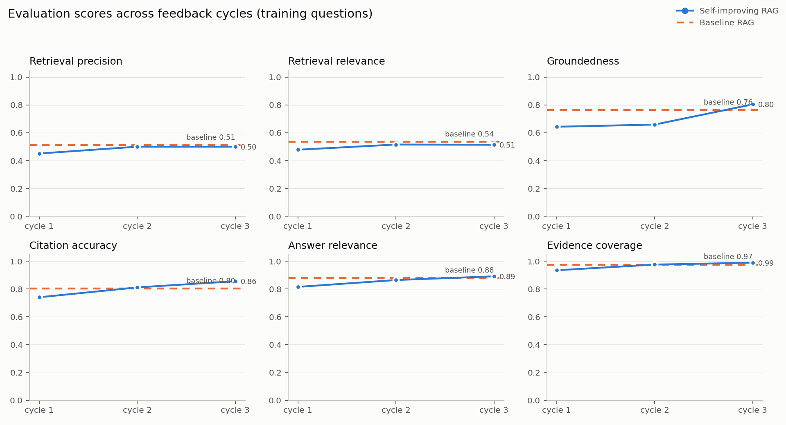
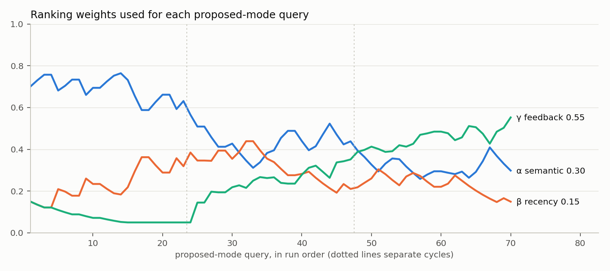
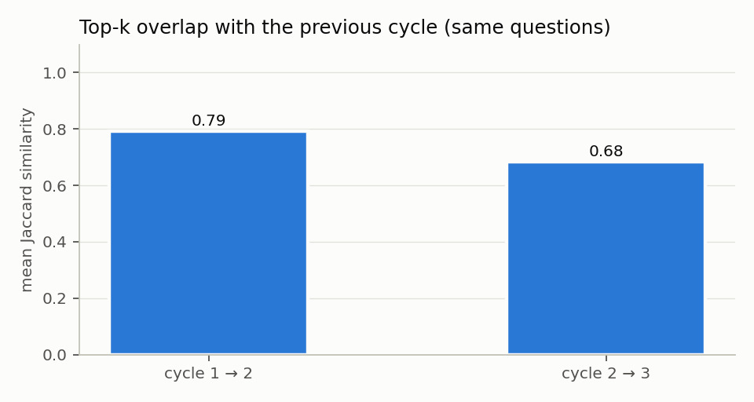
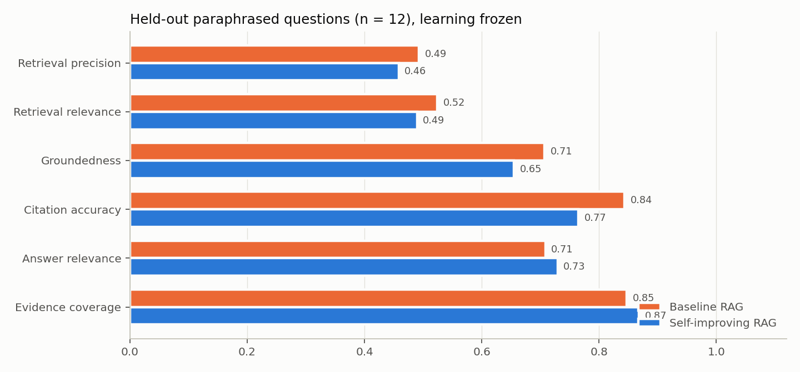
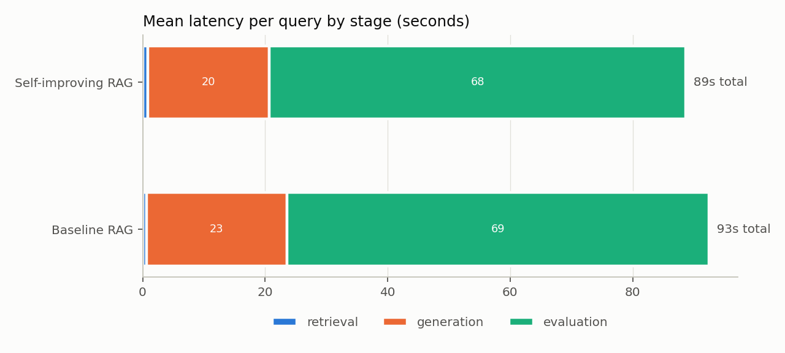

# Experiment exp-qwen7b-24q-3c

Generated by `evaluation/plot_results.py` from `queries.csv` and `summary.json`. Every number below is computed from stored query records; nothing is entered by hand.

## Configuration

- **questions:** 24
- **cycles:** 3
- **baseline_cycles:** 1
- **test:** paraphrase
- **test_limit:** 12
- **llm:** openai_compatible:qwen2.5:7b-instruct
- **evaluator:** qwen2.5:7b-instruct
- **embedding_model:** sentence-transformers/all-MiniLM-L6-v2
- **top_k:** 8
- **initial_weights:** [0.7, 0.15, 0.15]
- **weight_bounds:** [0.05, 0.9]
- **learning_rate:** 0.1

## Mean scores per cycle

| cycle | phase | mode | n | precision | relevance | groundedness | citation acc. | answer rel. | coverage | overall | latency (s) |
|---|---|---|---|---|---|---|---|---|---|---|---|
| 1 | train | baseline | 23 | 0.511 | 0.535 | 0.763 | 0.803 | 0.880 | 0.975 | 0.745 | 94.854 |
| 1 | train | proposed | 23 | 0.451 | 0.478 | 0.643 | 0.741 | 0.815 | 0.935 | 0.677 | 79.880 |
| 2 | train | proposed | 24 | 0.500 | 0.516 | 0.659 | 0.812 | 0.865 | 0.976 | 0.721 | 109.601 |
| 3 | train | proposed | 23 | 0.500 | 0.514 | 0.805 | 0.856 | 0.891 | 0.989 | 0.759 | 83.528 |
| test | test | baseline | 12 | 0.493 | 0.524 | 0.707 | 0.844 | 0.708 | 0.847 | 0.687 | 88.086 |
| test | test | proposed | 12 | 0.458 | 0.490 | 0.655 | 0.765 | 0.729 | 0.868 | 0.661 | 73.873 |

## Ranking weights at the end of each cycle

| after | α | β | γ |
|---|---|---|---|
| start | 0.700 | 0.150 | 0.150 |
| cycle 1 | 0.565 | 0.385 | 0.050 |
| cycle 2 | 0.394 | 0.218 | 0.388 |
| cycle 3 | 0.268 | 0.167 | 0.564 |
| test (frozen) | 0.268 | 0.167 | 0.564 |

## Retrieval change between cycles

| cycles | mean top-k Jaccard | questions |
|---|---|---|
| 1 → 2 | 0.793 | 23 |
| 2 → 3 | 0.684 | 23 |

## Held-out paraphrases (paired, learning frozen)

| metric | baseline | proposed | mean diff | 95% bootstrap CI | wins / losses |
|---|---|---|---|---|---|
| retrieval_precision | 0.493 | 0.458 | -0.035 | [-0.128, +0.059] | 2 / 5 of 12 |
| retrieval_relevance | 0.524 | 0.490 | -0.035 | [-0.135, +0.062] | 2 / 4 of 12 |
| groundedness | 0.707 | 0.655 | -0.052 | [-0.132, +0.026] | 1 / 4 of 12 |
| citation_accuracy | 0.844 | 0.765 | -0.079 | [-0.294, +0.164] | 1 / 5 of 12 |
| answer_relevance | 0.708 | 0.729 | +0.021 | [+0.000, +0.062] | 1 / 0 of 12 |
| evidence_coverage | 0.847 | 0.868 | +0.021 | [-0.062, +0.125] | 1 / 1 of 12 |
| overall | 0.687 | 0.661 | -0.026 | [-0.075, +0.026] | 3 / 7 of 12 |

## Run health

- **Queries:** 120
- **Failed:** 3
- **Evaluation errors:** 0

## Charts

